

# TRƯỜNG ĐẠI HỌC BÁCH KHOA HÀ NỘI
### TRƯỜNG CƠ KHÍ

 

# ĐỒ ÁN THIẾT KẾ KỸ THUẬT

## THIẾT KẾ BỘ THÍ NGHIỆM CƠ KHÍ PHÁT HIỆN VẾT NỨT BÁNH RĂNG BẰNG PHÂN TÍCH TÍN HIỆU RUNG ĐỘNG

*Design of a Mechanical Test Rig for Gear Crack Detection via Vibration Signal Analysis*

  

| | |
|---|---|
| **Sinh viên thực hiện** | …………………………… |
| **Lớp / Khóa** | …………………………… |
| **Giảng viên hướng dẫn** | …………………………… |
| **Bộ môn** | Cơ sở thiết kế máy & Robot |
| **Năm học** | 2025 – 2026 |

  

*Hà Nội, 2026*

---

## PHIẾU GIAO NHIỆM VỤ ĐỒ ÁN

**1. Tên đề tài:** Thiết kế bộ thí nghiệm cơ khí phục vụ nghiên cứu phát hiện vết nứt chân răng bánh răng dựa trên phân tích tín hiệu rung động.

**2. Số liệu cho trước:**
- Hộp số thử nghiệm: 1 cấp bánh răng trụ răng thẳng; mô đun *m* = 3 mm; số răng *Z₁* = 20, *Z₂* = 40; góc áp lực *α* = 20°; bề rộng răng *b* = 25 mm; vật liệu 20CrMnTi.
- Dải tốc độ pinion: *n₁* = 500 – 1500 rpm. Momen định mức tại pinion *T₁* = 20 N·m.
- Yêu cầu thu thập tín hiệu rung: *fₛ* ≥ 51,2 kS/s/kênh, DAQ ≥ 24-bit.

**3. Nội dung thực hiện:**
1. Tổng quan và cơ sở lý thuyết (TVMS, động lực học, xử lý tín hiệu).
2. Tính chọn động cơ và hệ truyền động.
3. Tính toán thiết kế bộ truyền bánh răng, trục, then, ổ lăn, khớp nối.
4. Kiểm nghiệm động lực học rotor (tốc độ tới hạn) và thiết kế hệ cách rung.
5. Thiết kế hệ đo, quy trình thực nghiệm; mô phỏng kết quả dự kiến.

**4. Bản vẽ:** Bản vẽ lắp tổng thể; bản vẽ chi tiết trục; sơ đồ bố trí cảm biến & điều khiển.

---

## LỜI NÓI ĐẦU

Hỏng hóc bánh răng — đặc biệt là vết nứt chân răng do mỏi — là một trong những nguyên nhân sự cố nghiêm trọng nhất của hệ truyền động cơ khí. Việc phát hiện sớm vết nứt thông qua phân tích tín hiệu rung động có ý nghĩa lớn trong bảo trì dự đoán. Để nghiên cứu vấn đề này một cách định lượng, cần có một **bộ thí nghiệm cơ khí (test rig)** được thiết kế bài bản, cho phép tạo vết nứt có kiểm soát và thu thập tín hiệu rung trung thực.

Đồ án trình bày quy trình **tính toán thiết kế đầy đủ** bộ thí nghiệm: từ chọn động cơ, thiết kế trục, chọn ổ lăn – khớp nối, kiểm nghiệm tốc độ tới hạn đến thiết kế hệ cách rung và hệ đo. Mọi công thức đều kèm thay số và kết quả, minh họa bằng hình vẽ kỹ thuật.

---

## MỤC LỤC

- [Chương 1. TỔNG QUAN](#chương-1-tổng-quan)
- [Chương 2. CƠ SỞ LÝ THUYẾT](#chương-2-cơ-sở-lý-thuyết)
- [Chương 3. TÍNH TOÁN THIẾT KẾ BỘ THÍ NGHIỆM](#chương-3-tính-toán-thiết-kế-bộ-thí-nghiệm)
- [Chương 4. THIẾT KẾ HỆ ĐO VÀ QUY TRÌNH THỰC NGHIỆM](#chương-4-thiết-kế-hệ-đo-và-quy-trình-thực-nghiệm)
- [Chương 5. MÔ PHỎNG VÀ KẾT QUẢ DỰ KIẾN](#chương-5-mô-phỏng-và-kết-quả-dự-kiến)
- [KẾT LUẬN VÀ HƯỚNG PHÁT TRIỂN](#kết-luận-và-hướng-phát-triển)
- [TÀI LIỆU THAM KHẢO](#tài-liệu-tham-khảo)
- [PHỤ LỤC](#phụ-lục)

### Danh mục hình vẽ

| Hình | Nội dung |
|---|---|
| 2.1 | Mô hình động lực học 6-DOF |
| 3.1 | Sơ đồ bố trí tổng thể test rig |
| 3.2 | Sơ đồ động học hệ truyền động |
| 3.3 | Hình học ăn khớp cặp bánh răng |
| 3.4 | Sơ đồ lực và momen tác dụng lên trục |
| 3.5 | Biểu đồ nội lực trục pinion |
| 3.6 | Kết cấu trục bậc pinion |
| 3.7 | Biểu đồ Campbell – tách tốc độ tới hạn |
| 3.8 | Đường cong truyền suất hệ cách rung |
| 3.9 | Tuổi thọ ổ lăn theo tải |
| 5.1 | Đường cong TVMS lành / có nứt |
| 5.2 | Tín hiệu rung mô phỏng và phổ tần số |

### Danh mục ký hiệu

| Ký hiệu | Ý nghĩa | Đơn vị |
|---|---|---|
| *m* | Mô đun bánh răng | mm |
| *Z₁, Z₂* | Số răng pinion / gear | – |
| *d₁, d₂* | Đường kính vòng chia | mm |
| *T₁, T₂* | Momen xoắn trục vào / ra | N·m |
| *Ft, Fr, Fn* | Lực tiếp tuyến / hướng kính / pháp tuyến | N |
| *P* | Công suất | kW |
| *[τ]* | Ứng suất xoắn cho phép | MPa |
| *C, P_t* | Tải động cơ bản / tải tương đương ổ | N |
| *f_n, f_iso* | Tần số riêng / tần số riêng hệ cách rung | Hz |
| *K_mesh* | Độ cứng ăn khớp theo thời gian (TVMS) | N/m |

---

# Chương 1. TỔNG QUAN

## 1.1. Đặt vấn đề

Trong các hệ truyền động cơ khí, bánh răng chịu ứng suất uốn theo chu kỳ tại chân răng. Khi vượt giới hạn mỏi, vết nứt khởi tạo và truyền lan theo định luật Paris:

$$\frac{da}{dN} = C\,(\Delta K)^{m}$$

trong đó $a$ là chiều sâu vết nứt, $N$ là số chu kỳ, $\Delta K$ là biên độ hệ số cường độ ứng suất, $C, m$ là hằng số vật liệu. Vết nứt làm **giảm cục bộ độ cứng ăn khớp**, gây điều chế biên độ/tần số trong tín hiệu rung — đây là cơ sở để chẩn đoán.

## 1.2. Tình hình nghiên cứu

Các nghiên cứu tiêu biểu (Mohammed 2013, Chen & Shao 2011, Liang 2015, Jiang 2024) đều dựa trên ba trụ cột: (i) tính độ cứng ăn khớp theo thời gian TVMS, (ii) mô hình động lực học hệ bánh răng, (iii) phân tích tín hiệu rung. Hầu hết sử dụng bánh răng trụ thẳng 1 cấp, cấu hình *motor – hộp số – phanh* (open-loop), tốc độ 500 – 1500 rpm.

## 1.3. Mục tiêu, đối tượng và phạm vi

- **Mục tiêu:** thiết kế hoàn chỉnh bộ thí nghiệm cơ khí cho phép tạo vết nứt có kiểm soát và thu tín hiệu rung trung thực, độ lặp lại cao.
- **Đối tượng:** hộp số 1 cấp spur gear (*m*=3, *Z₁/Z₂*=20/40).
- **Phạm vi:** tính toán thiết kế cơ khí (động cơ, trục, ổ, khớp, rotordynamics, cách rung) và hệ đo; không bao gồm chế tạo thực tế.

## 1.4. Phương pháp nghiên cứu

Kết hợp tính toán giải tích theo tiêu chuẩn (ISO 6336, ISO 281, Shigley, Trịnh Chất), kiểm chứng bằng mô phỏng (FEM/MATLAB) và thực nghiệm trên test rig.

---

# Chương 2. CƠ SỞ LÝ THUYẾT

## 2.1. Cơ chế hình thành và phát triển vết nứt

Vết nứt chân răng phát triển qua 3 giai đoạn: **khởi tạo** (micro-crack tại vùng tập trung ứng suất), **truyền lan ổn định** (theo định luật Paris) và **truyền lan nhanh** (khi $K \ge K_{Ic}$ → gãy răng).

## 2.2. Độ cứng ăn khớp theo thời gian (TVMS)

Theo phương pháp thế năng biến dạng (Yang & Lin, 1987), răng được mô hình như thanh console không đều. Tổng độ cứng một cặp răng ăn khớp:

$$\frac{1}{k_{mesh}} = \frac{1}{k_H} + \sum_{i=1}^{2}\left(\frac{1}{k_{b,i}} + \frac{1}{k_{s,i}} + \frac{1}{k_{a,i}} + \frac{1}{k_{f,i}}\right)$$

với các thành phần: Hertz $k_H$, uốn $k_b$, trượt $k_s$, nén dọc trục $k_a$, biến dạng nền $k_f$. Độ cứng nền theo Sainsot (2004):

$$\frac{1}{k_f} = \frac{\cos^2\alpha_m}{EL}\left[ L^{\ast}\left(\frac{u_f}{S_f}\right)^{2} + M^{\ast}\left(\frac{u_f}{S_f}\right) + P^{\ast}\left(1 + Q^{\ast}\tan^2\alpha_m\right)\right]$$

Khi có vết nứt, chiều cao tiết diện hữu hiệu giảm: $h_{x}^{crack}(x) = h_{x}^{healthy}(x) - q(x)$, làm $K_{mesh}$ giảm cục bộ.

## 2.3. Mô hình động lực học hệ bánh răng 6-DOF

Vectơ tọa độ tổng quát $\mathbf{q} = [x_1, y_1, \theta_1, x_2, y_2, \theta_2]^{T}$. Phương trình chuyển động:

$$\mathbf{M}\ddot{\mathbf{q}} + \mathbf{C}\dot{\mathbf{q}} + \mathbf{K}(t)\,\mathbf{q} = \mathbf{F}_{ext}(t)$$

Biến dạng theo phương ăn khớp (DTE):

$$\delta(t) = (x_1 - x_2)\sin\varphi + (y_1 - y_2)\cos\varphi + r_{b1}\theta_1 - r_{b2}\theta_2 - e(t)$$

Lực ăn khớp: $F_{mesh}(t) = K_{mesh}(t)\,\delta(t) + C_{mesh}\,\dot\delta(t)$.

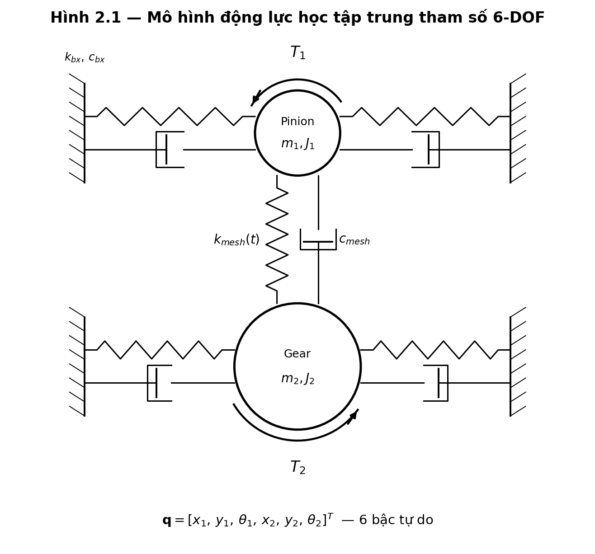

*Hình 2.1 — Mô hình động lực học tập trung tham số 6-DOF.*

## 2.4. Đặc trưng tín hiệu rung và chỉ số chẩn đoán

Các tần số đặc trưng: tần số quay $f_r = n/60$; tần số ăn khớp $f_{mesh} = Z f_r$; dải biên $f_{sb} = f_{mesh} \pm k f_r$.

| Chỉ số | Công thức | Độ nhạy vết nứt |
|---|---|---|
| RMS | $\sqrt{\frac{1}{N}\sum x_i^2}$ | Thấp–TB |
| Kurtosis | $\dfrac{\frac{1}{N}\sum (x_i-\mu)^4}{\sigma^4}$ | Cao (sớm) |
| Crest Factor | $x_{peak}/x_{RMS}$ | Trung bình |
| FM0 | $x_{pp(TSA)}/\sum A_{mesh}$ | Cao |
| NA4 | mômen bậc 4 chuẩn hóa | Cao, ổn định |

---

# Chương 3. TÍNH TOÁN THIẾT KẾ BỘ THÍ NGHIỆM

## 3.1. Sơ đồ bố trí và thông số đầu vào

Hệ thống bố trí dạng đường thẳng *động cơ – encoder – hộp số – torque – phanh* trên bệ máy đặt trên 4 gối cách rung.

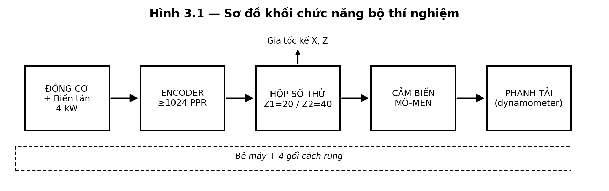

*Hình 3.1 — Sơ đồ bố trí tổng thể bộ thí nghiệm.*

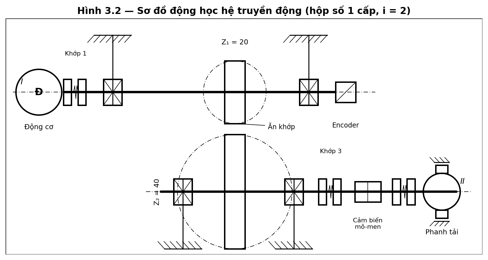

*Hình 3.2 — Sơ đồ động học hệ truyền động (i = 2).*

**Bảng 3.1 — Thông số đầu vào**

| Thông số | Ký hiệu | Giá trị |
|---|---|---|
| Mô đun | *m* | 3 mm |
| Số răng pinion / gear | *Z₁ / Z₂* | 20 / 40 |
| Đường kính vòng chia | *d₁ / d₂* | 60 / 120 mm |
| Khoảng cách trục | *a* | 90 mm |
| Góc áp lực | *α* | 20° |
| Bề rộng răng | *b* | 25 mm |
| Tốc độ pinion | *n₁* | 500–1500 rpm |
| Momen định mức pinion | *T₁* | 20 N·m |

Đường kính vòng chia: $d = m Z \Rightarrow d_1 = 60$ mm, $d_2 = 120$ mm. Khoảng cách trục $a = (d_1+d_2)/2 = 90$ mm.

## 3.2. Tính chọn động cơ điện

Công suất yêu cầu tại trục pinion:

$$P_1 = T_1\,\omega_1 = T_1\cdot\frac{2\pi n_1}{60}$$

Thay số tại $n_1 = 1500$ rpm:

$$\omega_1 = \frac{2\pi\cdot 1500}{60} = 157{,}08\ \text{rad/s}$$
$$P_1 = 20 \times 157{,}08 = 3141{,}6\ \text{W} \approx \mathbf{3{,}14\ kW}$$

Công suất tại trục động cơ (tổn hao khớp nối $\eta_{kn}=0{,}99$, hệ số làm việc $SF=1{,}25$):

$$P_{dc} = \frac{P_1}{\eta_{kn}}\cdot SF = \frac{3{,}14}{0{,}99}\times 1{,}25 = \mathbf{3{,}97\ kW}$$

→ **Chọn động cơ 4 kW, 4 cực, 1500 rpm (khung IEC 112M), điều khiển bằng biến tần vector** (hoặc servo PMSM 4 kW nếu cần ổn định tốc độ ±0,1%).

> ⚠ **Lưu ý thiết kế:** ở tốc độ thấp với momen không đổi, quạt gắn trục mất khả năng làm mát → cần động cơ làm mát cưỡng bức hoặc servo.

## 3.3. Tính toán bộ truyền bánh răng

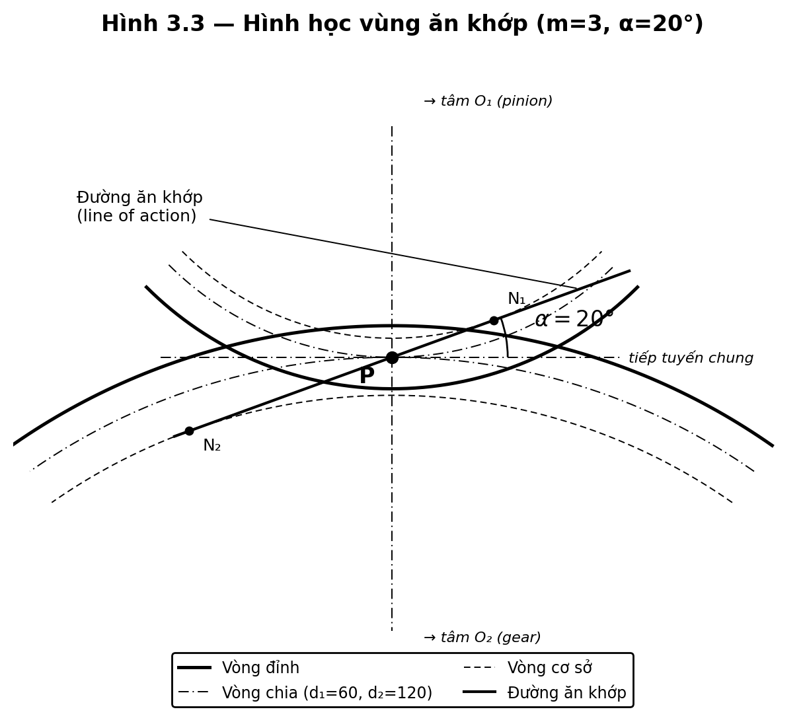

*Hình 3.3 — Hình học ăn khớp cặp bánh răng.*

**Lực ăn khớp** (Hình 3.4):

$$F_t = \frac{2 T_1}{d_1};\qquad F_r = F_t\tan\alpha;\qquad F_n = \frac{F_t}{\cos\alpha}$$

$$F_t = \frac{2\times 20000}{60} = 666{,}7\ \text{N}$$
$$F_r = 666{,}7\times\tan 20^\circ = 242{,}6\ \text{N}$$
$$F_n = \frac{666{,}7}{\cos 20^\circ} = \mathbf{709{,}5\ N}$$

**Kiểm bền uốn chân răng** (ISO 6336 / Lewis dạng rút gọn):

$$\sigma_F = \frac{F_t}{b\,m}\,Y_F Y_\beta K_v \le [\sigma_F]$$

Với $F_t = 666{,}7$ N, $b=25$ mm, $m=3$ mm, hệ số dạng răng $Y_F\approx 2{,}9$ ($Z=20$), $Y_\beta=1$, hệ số tải động $K_v\approx 1{,}15$:

$$\sigma_F = \frac{666{,}7}{25\times 3}\times 2{,}9\times 1{,}15 \approx 29{,}6\ \text{MPa}$$

So với giới hạn mỏi uốn của 20CrMnTi thấm than $[\sigma_F]\approx 0{,}9\sigma_{Flim}\approx 450$ MPa ⇒ **hệ số an toàn $S_F \approx 15$** (rất an toàn ở trạng thái lành; vết nứt được tạo nhân tạo bằng EDM, không do quá tải).

> 📌 *Ghi chú:* Hệ số an toàn cao là chủ ý — bánh răng phải đủ bền để không gãy đột ngột; vết nứt được đưa vào có kiểm soát theo các mức *a/h* = 0–50%.

## 3.4. Thiết kế trục pinion

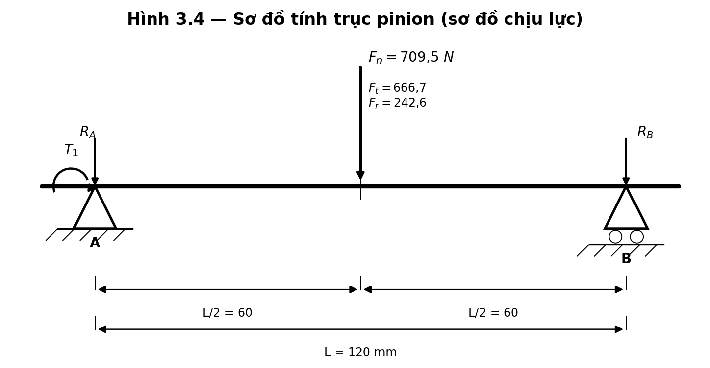

*Hình 3.4 — Sơ đồ lực và momen tác dụng lên trục pinion.*

Vật liệu trục: thép C45 tôi cải thiện, $\sigma_{ch}\approx 360$ MPa; ứng suất xoắn cho phép có rãnh then chọn bảo toàn $[\tau]=40$ MPa.

**a) Đường kính theo xoắn thuần:**

$$d \ge \sqrt[3]{\dfrac{16\,T_1}{\pi\,[\tau]}} = \sqrt[3]{\dfrac{16\times 20000}{\pi\times 40}} = \sqrt[3]{2546{,}5} \approx 13{,}7\ \text{mm}$$

**b) Momen uốn** (bánh răng giữa nhịp gối $L=120$ mm):

$$M = \frac{F_n L}{4} = \frac{709{,}5\times 120}{4} = 21\,285\ \text{N·mm}$$

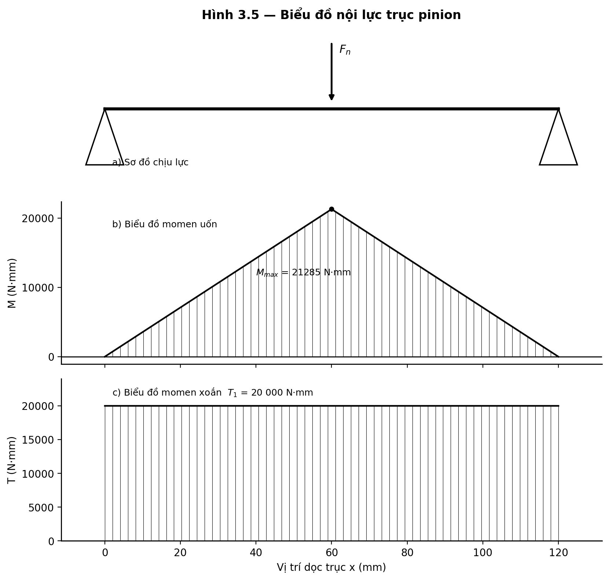

*Hình 3.5 — Biểu đồ momen uốn và momen xoắn dọc trục.*

**c) Đường kính theo momen tương đương** (thuyết bền ứng suất cắt lớn nhất):

$$d \ge \sqrt[3]{\dfrac{16}{\pi[\tau]}\sqrt{M^2 + T_1^{\,2}}}$$
$$\sqrt{M^2+T_1^2}=\sqrt{21285^2 + 20000^2}=29\,208\ \text{N·mm}$$
$$d \ge \sqrt[3]{\dfrac{16\times 29208}{\pi\times 40}} = \sqrt[3]{3719} \approx 15{,}5\ \text{mm}$$

**d) Kiểm bền mỏi & chọn đường kính:** kể hệ số tập trung ứng suất tại rãnh then và yêu cầu chu kỳ vô hạn (×≈1,3) rồi quy tròn theo dãy tiêu chuẩn:

$$d_{min}\times 1{,}3 \approx 20\ \text{mm} \Rightarrow \boxed{d = 20\ \text{mm (cổ ổ)},\ 25\ \text{mm (bệ bánh răng)}}$$

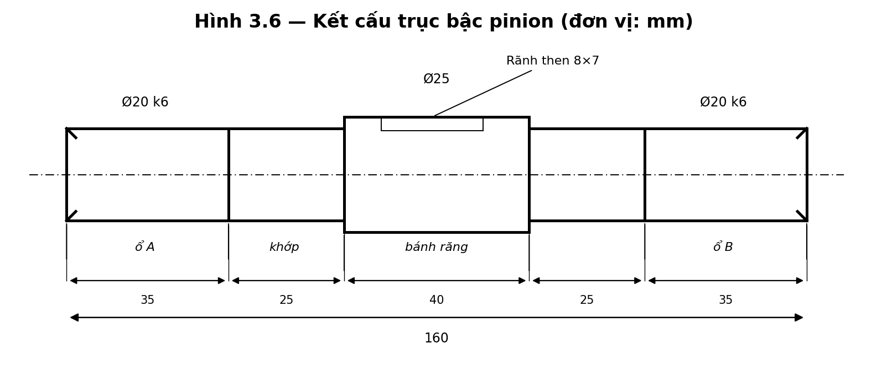

*Hình 3.6 — Kết cấu trục bậc pinion.*

## 3.5. Tính then và mối ghép

Chọn then bằng theo $d=25$ mm: $b\times h = 8\times 7$ mm, chiều dài $l_t = 22$ mm. Kiểm bền dập:

$$\sigma_d = \frac{2 T_1}{d\,l_t (h - t_1)} = \frac{2\times 20000}{25\times 22\times 4} \approx 18{,}2\ \text{MPa} \le [\sigma_d]\approx 100\ \text{MPa}\ \checkmark$$

Kiểm bền cắt: $\tau_c = \dfrac{2T_1}{d\,l_t\,b} = \dfrac{2\times 20000}{25\times 22\times 8} \approx 9{,}1$ MPa $\le [\tau_c]\approx 60$ MPa ✓.

Lắp ghép: ổ–cổ trục **k6**, ổ–lỗ vỏ **H7** (ISO 286).

## 3.6. Tính chọn và kiểm nghiệm ổ lăn

Phản lực gối $\approx F_n/2 + $ trọng lượng cụm:

$$P_t \approx \frac{709{,}5}{2} + 25 \approx 380\ \text{N}$$

Chọn ổ bi đỡ **6204** ($d=20$, $D=47$, $B=14$ mm; $C=12{,}7$ kN; $C_0=6{,}55$ kN). Tuổi thọ danh nghĩa:

$$L_{10} = \left(\frac{C}{P_t}\right)^{3}\!\times 10^{6}\ \text{[vòng]};\qquad L_{10h} = \frac{L_{10}}{60\,n}$$
$$\frac{C}{P_t} = \frac{12700}{380} = 33{,}4 \Rightarrow L_{10} = 33{,}4^{3}\times 10^{6} = 3{,}73\times 10^{10}\ \text{vòng}$$
$$L_{10h} = \frac{3{,}73\times 10^{10}}{60\times 1500} \approx \mathbf{4{,}1\times 10^{5}\ giờ}$$

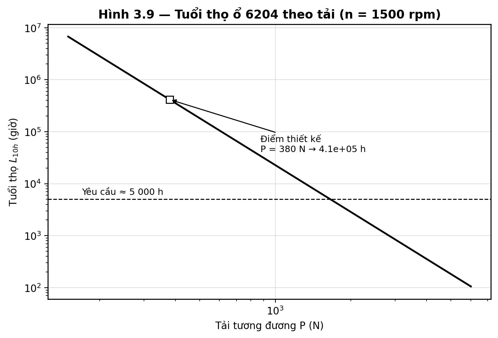

*Hình 3.9 — Tuổi thọ ổ 6204 theo tải (vượt xa yêu cầu ≈ 5000 h).*

## 3.7. Tính chọn khớp nối

$$T_{khop} \ge T_1\cdot K_d = 20\times 1{,}5 = 30\ \text{N·m}$$

→ Chọn khớp đàn hồi danh định ≥ 30 N·m, bore Ø20. **Phía encoder dùng khớp đĩa zero-backlash** để bảo toàn quan hệ pha cho thuật toán TSA. Dung sai lệch trục: song song < 0,05 mm; góc < 0,5°.

## 3.8. Kiểm nghiệm động lực học rotor – tốc độ tới hạn

Mô hình dầm gối tựa hai đầu mang khối lượng tập trung ở giữa:

$$I = \frac{\pi d^4}{64};\qquad k = \frac{48\,E\,I}{L^3};\qquad f_n = \frac{1}{2\pi}\sqrt{\frac{k}{m}}$$

$$I = \frac{\pi (0{,}02)^4}{64} = 7{,}854\times 10^{-9}\ \text{m}^4$$
$$k = \frac{48\times 2{,}06\times 10^{11}\times 7{,}854\times 10^{-9}}{0{,}12^{3}} = 4{,}494\times 10^{7}\ \text{N/m}$$
$$m_{br} \approx \rho\,\frac{\pi}{4} d_2^2\, b = 7850\times 0{,}7854\times 0{,}12^2\times 0{,}025 \approx 2{,}22\ \text{kg}$$
$$f_n = \frac{1}{2\pi}\sqrt{\frac{4{,}494\times 10^{7}}{2{,}22}} \approx \mathbf{719\ Hz}\quad (N_{cr}\approx 43\,150\ \text{rpm})$$

Hệ số tách: $f_n/f_{op} = 719/25 \approx 29$ ⇒ rotor làm việc **dưới tới hạn (sub-critical)**, an toàn cộng hưởng uốn.

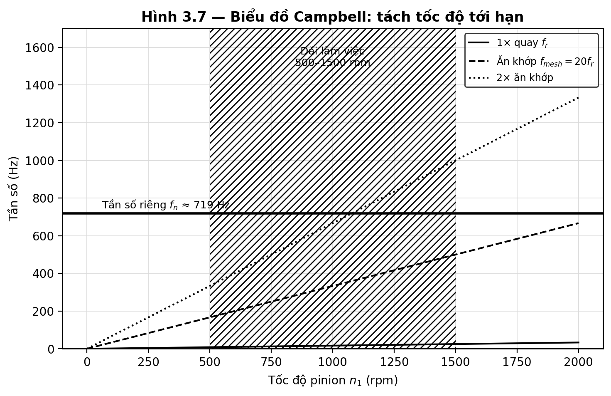

*Hình 3.7 — Biểu đồ Campbell: dải làm việc nằm xa tốc độ tới hạn.*

> ⚠ **Lưu ý:** $f_n\approx 719$ Hz nằm giữa $f_{mesh}=500$ Hz và $2f_{mesh}=1000$ Hz → cần phân tích modal (FEA/gõ búa) để bảo đảm các mode kết cấu không trùng $f_{mesh}\pm k f_r$.

## 3.9. Thiết kế khung bệ và hệ cách rung

Yêu cầu tần số riêng hệ cách rung $f_{iso}\le f_{kt}/\sqrt{2}$. Với kích thích thấp nhất $f_r$(500 rpm) = 8,33 Hz → chọn $f_{iso}=4{,}5$ Hz; khối lượng toàn hệ $m\approx 180$ kg:

$$k_{tong} = (2\pi f_{iso})^2 m = (2\pi\times 4{,}5)^2\times 180 = 1{,}439\times 10^{5}\ \text{N/m}$$
$$\delta_{tinh} = \frac{mg}{k} = \frac{180\times 9{,}81}{1{,}439\times 10^{5}} \approx 12{,}3\ \text{mm}$$

Truyền suất $T = 1/(r^2-1)$ với $r=f_{kt}/f_{iso}$:

$$r_{1500} = 25/4{,}5 = 5{,}56 \Rightarrow T \approx 0{,}034\ \text{(cách ly rất tốt)}$$

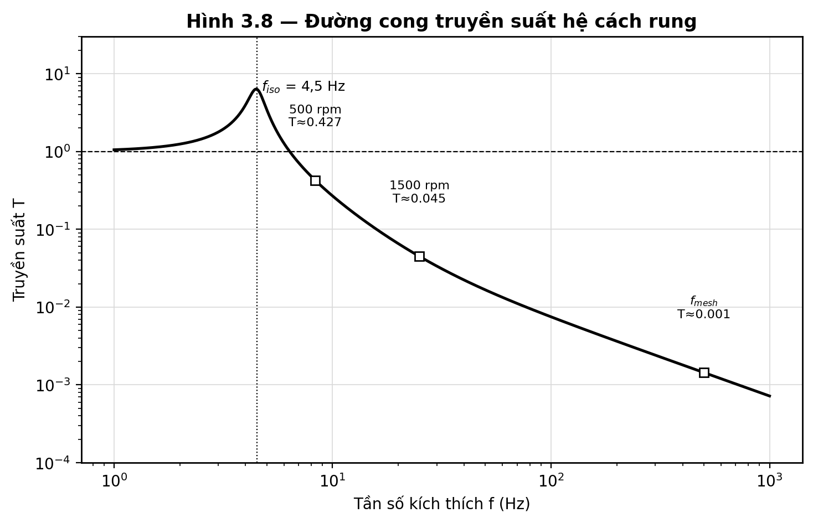

*Hình 3.8 — Đường cong truyền suất hệ cách rung (f_iso = 4,5 Hz).*

## 3.10. Hệ thống tạo tải và tản nhiệt

Công suất phải hấp thụ thành nhiệt tại phanh:

$$P_2 = P_1\,\eta_{hs} \approx 3{,}14\times 0{,}97 \approx \mathbf{3{,}05\ kW}\ \text{(liên tục)}$$

> ⚠ Phanh bột từ 40–50 N·m thông thường chỉ tản liên tục ~1–2 kW. Khuyến nghị **dynamometer dòng xoáy làm mát nước** công suất liên tục ≥ 3,5 kW, có cảm biến nhiệt và điều khiển tải vòng kín theo torque transducer.

---

# Chương 4. THIẾT KẾ HỆ ĐO VÀ QUY TRÌNH THỰC NGHIỆM

## 4.1. Bố trí cảm biến

- **Accelerometer** ICP/IEPE 100 mV/g, 0,5 Hz–10 kHz; gá **stud-mount** trên vấu phẳng vỏ ổ (phẳng < 0,02 mm, Ra < 0,8 µm), hai phương X (hướng kính) và Z (dọc trục).
- **Encoder** ≥ 1024 PPR (đề xuất 2048) đồng trục pinion qua khớp zero-backlash — bắt buộc cho TSA.
- **Torque transducer** non-contact 0–100 N·m, ±0,1 % FS.

## 4.2. Cấu hình DAQ

ADC ≥ 24-bit, lấy mẫu đồng bộ, $f_s \ge 51{,}2$ kS/s/kênh, bộ lọc anti-aliasing. Kiểm tra theo Nyquist mở rộng:

$$f_s \ge 2{,}56\times 10\times f_{mesh} = 2{,}56\times 10\times 500 = 12{,}8\ \text{kHz} \ll 51{,}2\ \text{kHz}\ \checkmark$$

## 4.3. Ma trận thực nghiệm

**Bảng 4.1 — Ma trận thực nghiệm**

| Biến | Mức | Ghi chú |
|---|---|---|
| Mức nứt *a/h* | 0, 10, 20, 30, 40, 50 % | 6 bánh răng riêng |
| Tốc độ | 500, 750, 1000, 1500 rpm | ±5 rpm nhờ biến tần |
| Tải | 25, 50, 75, 100 % T_rated | đo bằng torque transducer |
| Lặp lại | 3–5 lần/điều kiện | ANOVA xác nhận |

Tổng: $6\times4\times4\times3 = 288$ lần đo (full factorial); rút gọn bằng Taguchi L₁₈ còn 54 lần nếu cần.

## 4.4. Quy trình tạo vết nứt

Dùng cắt dây EDM tạo rãnh tại chân răng, độ chính xác ±0,05 mm, các mức *a/h* = 0–50 %. Ưu điểm: tái lập tốt, kiểm soát chính xác kích thước.

---

# Chương 5. MÔ PHỎNG VÀ KẾT QUẢ DỰ KIẾN

## 5.1. Độ cứng ăn khớp TVMS mô phỏng

Khi răng nứt đi vào vùng ăn khớp, $K_{mesh}$ giảm cục bộ; mức giảm tỉ lệ với chiều sâu vết nứt *a/h*.

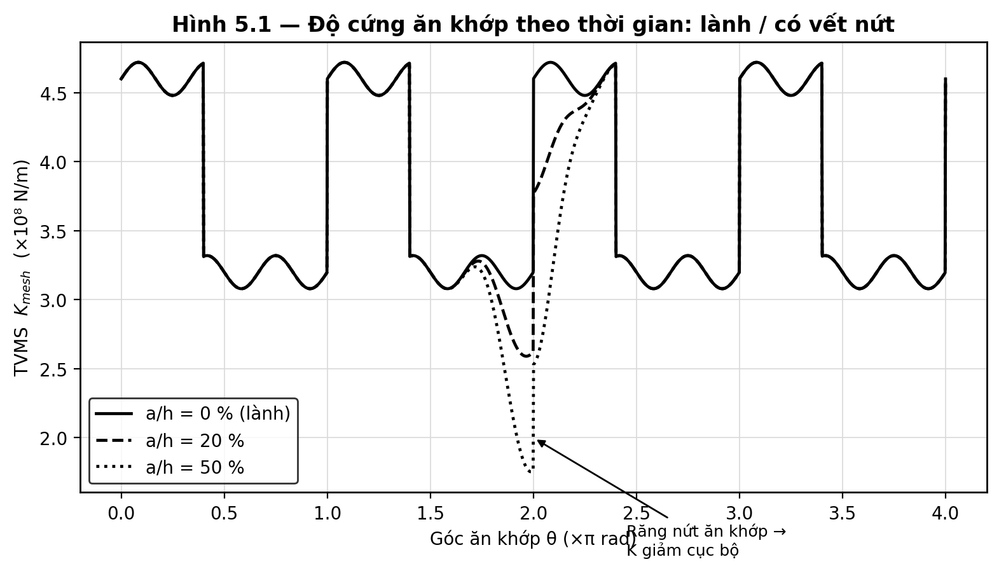

*Hình 5.1 — TVMS lành so với có vết nứt (a/h = 0, 20, 50 %).*

## 5.2. Đáp ứng rung dự kiến

Giải hệ 6-DOF (Newmark-β, $\Delta t \le T_{mesh}/50$) cho tín hiệu gia tốc. Vết nứt sinh **xung tuần hoàn chu kỳ $1/f_r$** trên miền thời gian và **dải biên (sidebands)** quanh $f_{mesh}$ trên miền tần số.

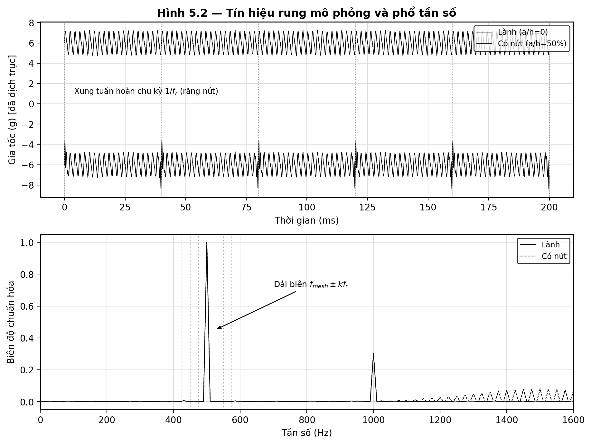

*Hình 5.2 — Tín hiệu rung mô phỏng và phổ tần số (lành / có nứt).*

## 5.3. Độ nhạy chỉ số chẩn đoán

Dự kiến: RMS tăng đơn điệu theo *a/h*; Kurtosis & Crest Factor nhạy ở giai đoạn sớm rồi giảm khi nứt lớn; NA4/FM0 ổn định hơn; chỉ số SWR (Jiang 2024) hiệu quả hơn Kurtosis ~18 %.

---

# KẾT LUẬN VÀ HƯỚNG PHÁT TRIỂN

**Kết luận:** Đồ án đã hoàn thành tính toán thiết kế đầy đủ bộ thí nghiệm cơ khí phát hiện vết nứt bánh răng:

- Chọn động cơ 4 kW + biến tần ($P_1 = 3{,}14$ kW).
- Trục pinion Ø20–25 mm (C45), kiểm bền xoắn–uốn–mỏi đạt yêu cầu.
- Ổ 6204 ($L_{10h}\approx 4{,}1\times10^5$ h), khớp nối ≥ 30 N·m.
- Tốc độ tới hạn $f_n\approx 719$ Hz, hệ số tách ≈ 29 (an toàn cộng hưởng).
- Hệ cách rung $f_{iso}=4{,}5$ Hz, truyền suất rất nhỏ ở dải làm việc.

**Ba khuyến nghị kỹ thuật quan trọng** đã nêu (mục ⚠): làm mát cưỡng bức động cơ ở tốc độ thấp; phân tích modal tránh trùng $f_n$ với dải $f_{mesh}$; dùng dynamometer dòng xoáy làm mát nước cho tải liên tục 3 kW.

**Hướng phát triển:** mở rộng sang bánh răng nghiêng/hành tinh; tích hợp mô hình crack 3D parabol; áp dụng học máy (CNN/SVM) phân loại mức hỏng hóc theo thời gian thực.

---

# TÀI LIỆU THAM KHẢO

[1] Trịnh Chất, Lê Văn Uyển. *Tính toán thiết kế hệ dẫn động cơ khí*, Tập 1–2. NXB Giáo dục.
[2] R. G. Budynas, J. K. Nisbett. *Shigley's Mechanical Engineering Design*, 11th ed., McGraw-Hill.
[3] ISO 6336 (Parts 1–6). *Calculation of load capacity of spur and helical gears*.
[4] ISO 281. *Rolling bearings — Dynamic load ratings and rating life*.
[5] Yang, D.C.H., Lin, J.Y. (1987). *Hertzian damping, tooth friction and bending elasticity in gear impact dynamics*. ASME J. Mech. Des., 109(2), 189–196.
[6] Mohammed, O.D., Rantatalo, M., Aidanpää, J.O. (2013). *Improving mesh stiffness calculation of cracked gears for vibration-based fault analysis*. Eng. Failure Analysis, 34, 235–251.
[7] Sainsot, P., Velex, P., Duverger, O. (2004). *Contribution of gear body to tooth deflections — a new bidimensional analytical formula*. ASME J. Mech. Des., 126(4), 748–752.
[8] Chen, Z., Shao, Y. (2011). *Dynamic simulation of spur gear with tooth root crack...* Eng. Failure Analysis, 18, 2149–2164.
[9] Jiang, F., et al. (2024). *Two novel indicators for gear crack diagnosis...* Mechanism and Machine Theory.
[10] S. S. Rao. *Mechanical Vibrations*, Pearson.
[11] A. G. Piersol, T. L. Paez (eds.). *Harris' Shock and Vibration Handbook*, 6th ed.
[12] R. B. Randall. *Vibration-based Condition Monitoring*, Wiley.

> Danh mục đầy đủ và chi tiết hơn xem file *Danh_muc_tai_lieu_tham_khao_tinh_toan_thiet_ke.md*.

---

# PHỤ LỤC

## PL-A. Bảng tổng hợp kết quả tính toán

| Hạng mục | Công thức | Kết quả | Kết luận |
|---|---|---|---|
| Công suất pinion | $P_1=T_1\omega_1$ | 3,14 kW | — |
| Công suất động cơ | $P_1/\eta\cdot SF$ | 3,97 kW | Chọn 4 kW |
| Lực pháp tuyến | $F_t/\cos\alpha$ | 709,5 N | — |
| Momen uốn max | $F_nL/4$ | 21 285 N·mm | — |
| Đường kính trục | $\sqrt[3]{16\sqrt{M^2+T^2}/\pi[\tau]}$ | 15,5 → 20 mm | Đạt |
| Tuổi thọ ổ 6204 | $(C/P)^3 10^6/60n$ | 4,1·10⁵ h | Rất an toàn |
| Khớp nối | $T_1 K_d$ | ≥ 30 N·m | — |
| Tần số riêng | $\frac{1}{2\pi}\sqrt{k/m}$ | 719 Hz | Sub-critical |
| Tần số cách rung | $\frac{1}{2\pi}\sqrt{k/m}$ | 4,5 Hz | T ≪ 1 |
| Công suất tản nhiệt | $P_1\eta_{hs}$ | 3,05 kW | Cần dyno nước |

## PL-B. Mã nguồn

- `gen_do_an_figures.py` — sinh 12 hình thiết kế (matplotlib).
- `gen_test_rig_design.py` — sinh hồ sơ thiết kế .docx.
- Thư mục `do_an_figures/` — chứa toàn bộ hình PNG.

> *Lưu ý: số liệu mang tính thiết kế sơ bộ, phải đối chiếu catalog nhà sản xuất (ổ lăn, khớp nối, phanh, gối cách rung) trước khi chế tạo.*
